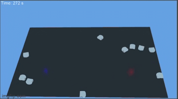
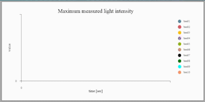
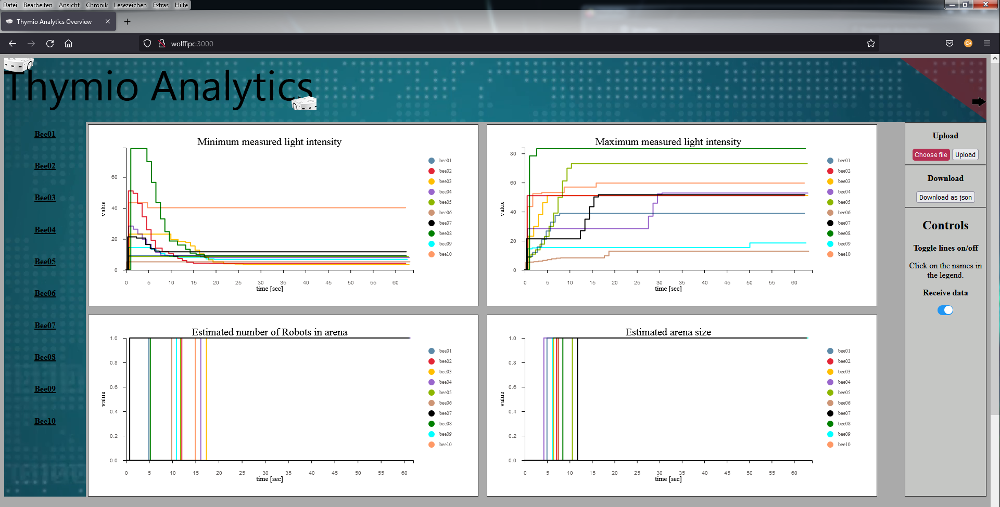
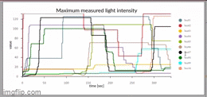
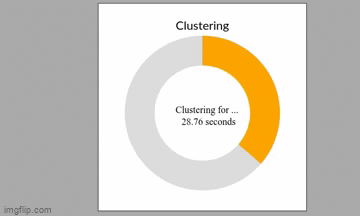
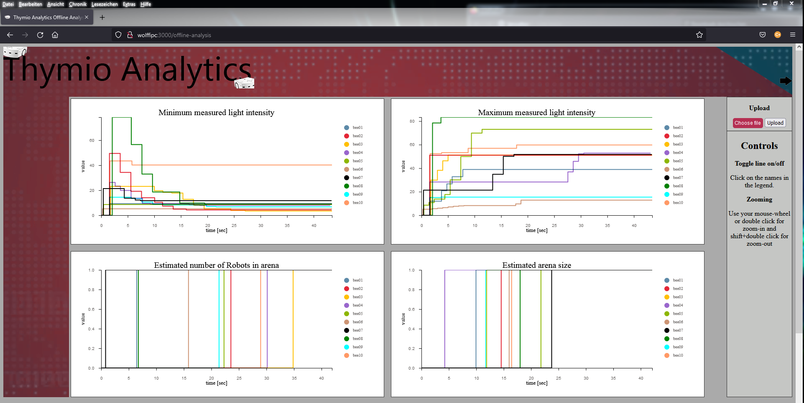
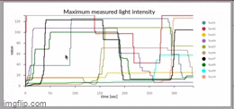

# Thymio-Analytics

### General information
This application visualize data from robots in the Webbrowser using [D3.js](https://d3js.org/). The robots perform the BEECLUST algorithm to aggregate
at the spot with the hightest light intensity. They driving forward as long as they can and measure the light intensity every second. If they encounter 
the border they turn randomly and moving forward again. If they meet another agent they exchange their collected data measure the light intensity and 
clustering on the spot. The clustering time depends on the light intensity.
You can find more information about this [here](https://eudl.eu/doi/10.4108/eai.3-12-2015.2262877).
The agents collect four different types of data: minimum light intensity, maximum light intensity, estimated number of robots in the arena
and the estimated size of the arena. In the beginning every agent registers himself at the fileserver and sends updates with his current values
with a frequency of 1 Hz. For better imagination here are GIF's from both. The simulation is made with [Webots](https://www.cyberbotics.com/)
For faster loading times the GIF only shows the plot of the maximum measured light intensity.

   

### Online analytics

  

The main page shows plots for the four collected data types. For a better overview it is possible to toggle on/off lines by clicking on the name of the robot. 
This can be done in every plot serparately.But there is a lot more which could be plotted. For this reason you can choose a  robot from the left sided list
to get more detailed page. The detailed page are inlcudes also the four plots from the main page and shows if the robot is clustering
and how much clustering time is remained. In the future here will be plots which show which of the received data are trustwhorthy by the fault detection. One plot
for every data type again.

   

On the right side of the page you can change to the offline analysis by clicking on the right corner of the banner. Also you can upload a json file first which
will redirecting you to the offline analysis too. Right below the upload button is the download button so you can save the received data as json file. As next
the controls of the plots are explained and as last a switch-button where you can turn off to request new data from the server. If it's turned on again the
client receives all data which the server received in this time followed by the updates.

### Offline analytics

  

In the offline analysis the client doesn't request new data from the server instead of this you have to upload them as json. Like in the online analysis you
toggle on/off the lines by clicking the names of the robots at the right side of the plot. Also you can zoom in and out and move the graph.

  

